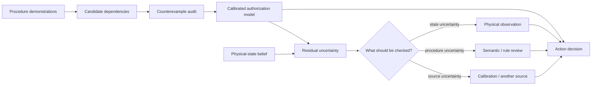

# DOVOD

**Decision-Oriented Verification of Observations and Dependencies**

DOVOD is a research framework for procedural decision support under incomplete and uncertain information. It studies two connected questions:

1. **Which observed dependencies are actually supported as prerequisites for an action?**
2. **What information should be acquired next when the current evidence is insufficient for a decision?**

The stable repository surface contains software, frozen reference results, and reproducibility material. The active Q1 research branch `q1/full-rebuild-20260905` additionally contains two separate manuscript drafts and reviewer-facing evidence under `research/q1_2026/`. Editorial/submission documents are still kept outside the codebase.

## Why DOVOD

Demonstration-driven systems often blur two different statements:

- “this step usually happened earlier”; and
- “this step is required before the next action can be allowed”.

DOVOD treats the first statement as evidence and the second as a hypothesis that must survive counterexamples. At decision time, low confidence is also not treated as one generic problem: the system distinguishes uncertainty about the physical state, uncertainty about the procedure/model, and uncertainty about information-source quality or cost.



## Q1 2026 two-paper research package

The frozen `main` baseline remains unchanged. The expanded reproducible research package is under [`research/q1_2026/`](research/q1_2026/README.md).

### Paper A

**From Sequence Regularity to Action Authorization: Decision-Equivalent and Certified Repair of Learned Preconditions**

Paper A is a downstream, learner-agnostic repair layer for **applicability/authorization decisions**. It combines positive-only non-identifiability, exact hitting-set diagnostics, contextual prerequisite exceptions/guards, exact and weighted-soft finite-vocabulary MILPs, independent certification, a frozen 160-cell AMLGym confirmatory protocol, and post-confirmatory reviewer diagnostics. The frozen primary AMLGym result is `7 wins / 68 ties / 0 losses` across 75 usable cells and `4 / 6 / 0` at the domain-mean level (`p=0.125`); it is interpreted as selective deployment evidence, not broad superiority.

V5 adds two explicitly post-confirmatory blocks without changing that primary claim: full-matrix random/frequency one-edit baselines and an independent Assembly101 held-out ordering audit. On Assembly101, 5 of 18 predecessor relations mined at frequency threshold 0.90 are contradicted by held-out labeled-correct behavior, reinforcing the claim boundary that frequent order is not mechanical necessity.

Draft: [`research/q1_2026/papers/PAPER_A_DRAFT.md`](research/q1_2026/papers/PAPER_A_DRAFT.md).

### Paper B

**Exact Evidence-Count Dynamic Programming and Cost-Robust Information Acquisition for Static Procedural Decisions**

Paper B studies a restricted static binary-evidence acquisition class. Its algorithmic contribution is an exact evidence-count Bellman representation, cross-checked against ordered-history and posterior-vector references. POMCP approximation is validated on 12 independent 512-world cases; MECCANO supplies a positive but concentrated non-myopic regime, IMPACT PSR supplies a retained negative lookahead regime, a controlled cost grid supplies first-action minimax-regret evidence, and Blue Birds is used only for the narrower held-out source-calibration claim.

Draft: [`research/q1_2026/papers/PAPER_B_DRAFT.md`](research/q1_2026/papers/PAPER_B_DRAFT.md).

The papers are scientifically separate. The joint story is architectural only: Paper A repairs learned authorization restrictions; Paper B decides which evidence to acquire when residual uncertainty remains.

## Frozen reference results

The stable experiment package is regression-checked against the following headline values:

| Question | Reference result |
|---|---:|
| Candidate unary relations | 272 |
| Refuted relations on MECCANO training evidence | 201 / 272 |
| Refuted relations in the IMPACT external analysis | 259 / 272 |
| Independent calibration recall | 0.8707 → 0.8853 |
| Refutations surviving loss of one evidence carrier, MECCANO | 162 / 201 |
| Refutations surviving loss of one evidence carrier, IMPACT | 184 / 259 |
| Mixed-uncertainty source-selection episodes | 187 |
| Myopic → exact expected cost at semantic cost = 1 | 1.7380 → 1.6657 |
| First-source change under asymmetric reliability | 33.15% |

These are benchmark-specific methodological results. They do **not** certify mechanical truth, industrial safety, measured human benefit, or live XR performance.

## Repository layout

```text
DOVOD/
├── src/procedural_ai/              # stable reusable API
├── experiments/                    # frozen/stable experiment families
├── research/reference_impl/        # preserved reference implementations
├── research/q1_2026/               # two-paper Q1 research package and drafts
├── prototypes/runtime/             # procedure/runtime/XR branch
├── results/                        # compact frozen stable outputs
├── configs/                        # experiment parameters
├── data/                           # local third-party data boundary
├── tests/                          # unit and snapshot tests
├── docs/                           # scope, provenance and roadmap
└── scripts/                        # verification and reproduction entry points
```

## Install

Python 3.10+ is recommended.

```bash
git clone https://github.com/lebedeffson/DOVOD.git
cd DOVOD
python -m venv .venv
source .venv/bin/activate          # Windows: .venv\Scripts\activate
python -m pip install -U pip
pip install -e ".[dev]"
```

## Verify the stable repository surface

No third-party dataset is required for the unit tests and frozen-result audit:

```bash
pytest -q
python scripts/verify_reference_results.py
python scripts/check_public_repo.py
```

## Reproduce the Q1 two-paper core

On the Q1 branch:

```bash
cd research/q1_2026
python -m pip install -r requirements.txt
make release
```

External AMLGym/Assembly101 studies are separately orchestrated because they depend on pinned third-party repositories and heavier runtimes. Blue Birds external calibration is also separated from the local core.

## Full stable-core rerun with raw procedural data

Raw MECCANO/IMPACT material is not redistributed by this repository. Obtain the datasets under their original terms. For MECCANO, place the PSR archive at:

```text
data/external/MECCANO_PSR_Annotations.zip
```

or set:

```bash
export PROCEDURAL_AI_MECCANO_PSR_ZIP=/absolute/path/MECCANO_PSR_Annotations.zip
```

Then run:

```bash
bash scripts/reproduce_core.sh
```

## Stable API example

```python
from procedural_ai import action_set

graph = {0: [], 1: [0], 2: [0, 1]}
state = [1, 0, 0]

print(action_set(state, graph))  # [1]
```

## Exact information-source planning

```python
from procedural_ai import SourceAwareResolutionPlanner

graphs = [
    {0: [], 1: [], 2: [0]},
    {0: [], 1: [], 2: [1]},
]

planner = SourceAwareResolutionPlanner(
    graphs,
    action=2,
    queryable_components=[0, 1],
    physical_cost=1.0,
    semantic_cost=1.0,
)

print(planner.solve([0.5, 0.5, 0.0]))
```

## Project boundaries

The stable prerequisite analysis concerns unary, unconditional, same-state relations. The Q1 Paper A expansion is still an applicability-decision layer, not causal mechanical discovery. Absence of a counterexample means **unfalsified in observed evidence**, not mechanically proven. Paper B optimizes declared finite probabilistic models; live sensor/expert behavior and real query costs require separate calibration. Blue Birds is source-calibration evidence, not procedural Bellman-policy validation. Post-confirmatory Paper A baselines and Assembly101 audits are not used to retrofit the frozen AMLGym significance result.

Read:

- [`docs/claim_boundary.md`](docs/claim_boundary.md)
- [`docs/datasets.md`](docs/datasets.md)
- [`docs/reproducibility.md`](docs/reproducibility.md)
- [`research/q1_2026/REPRODUCIBILITY.md`](research/q1_2026/REPRODUCIBILITY.md)
- [`research/q1_2026/RECOVERY_STATUS.md`](research/q1_2026/RECOVERY_STATUS.md)

## Related work from the team

- Trofimov, Y. V., Averkin, A. N., Lebedev, A. D., Lebedev, M. D., et al. *Algebraic operations on multilevel explanations and quantification of their uncertainty*. Soft Measurements and Computing, 2026. DOI: `10.36871/26189976.2026.02-2.008`.
- Trofimov, Y. V., Lebedev, A. D., Ilin, A. S., Averkin, A. N. *Verified Explainability Core: A GD-ANFIS/SHAP Hybrid Architecture for XAI 2.0*. Automatic Documentation and Mathematical Linguistics, 59(S5), S469–S478. DOI: `10.3103/S0005105525701420`.

## Citation

Citation metadata for the software artifact is provided in [`CITATION.cff`](CITATION.cff).

## License

No open-source license is declared yet. Until a license is selected, standard copyright restrictions apply.
