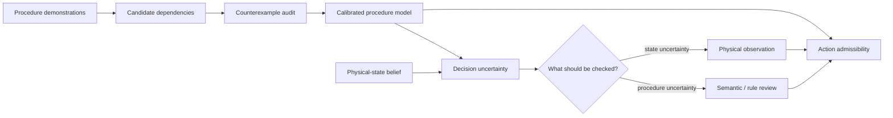

# DOVOD

**Decision-Oriented Verification of Observations and Dependencies**

DOVOD is a research framework for procedural decision support under incomplete and uncertain information. It studies two connected questions:

1. **Which observed dependencies are actually supported as prerequisites for an action?**
2. **What information should be acquired next when the current evidence is insufficient for a decision?**

The repository contains the software and reproducibility artifact only. Manuscripts, conference submissions, expert documents and editorial files are intentionally kept outside the codebase.

## Why DOVOD

Demonstration-driven systems often blur two very different statements:

- “this step usually happened earlier”; and
- “this step is required before the next action can be allowed”.

DOVOD treats the first statement as evidence and the second as a hypothesis that must survive counterexamples. The same principle is used at decision time: low confidence is not treated as one generic problem. The system distinguishes uncertainty about the physical state from uncertainty about the procedure model and chooses which source of information to query.



## Research line 1 — dependency validation

A frequently observed order is treated as a **candidate relation**, not as proof of necessity. If an action succeeds while a supposed prerequisite is absent, the observation is a direct counterexample and the relation is removed from the admissibility model.

The experiment family includes:

- counterexample-based relation pruning;
- independent-recording calibration;
- evidence-carrier robustness;
- sample-complexity analysis;
- semantic version spaces;
- prospective review prioritization.

## Research line 2 — information-source selection

Uncertainty can come from the physical state or from the procedure model itself. DOVOD models these sources separately and compares alternative interventions by expected information value, reliability and cost.

The experiment family includes:

- exact Bellman planning;
- strong one-step / myopic baselines;
- noisy-source Bayesian stress tests;
- reliability sweeps;
- cost misspecification;
- exact state-space scaling.

## Reference results

The frozen experiment package is regression-checked against the following headline values:

| Question | Reference result |
|---|---:|
| Candidate unary relations | 272 |
| Refuted relations on MECCANO training evidence | 201 / 272 |
| Refuted relations in the IMPACT external analysis | 259 / 272 |
| Independent calibration recall | 0.8707 → 0.8853 |
| Refutations surviving loss of one evidence carrier, MECCANO | 162 / 201 |
| Refutations surviving loss of one evidence carrier, IMPACT | 184 / 259 |
| Mixed-uncertainty source-selection episodes | 187 |
| Myopic → exact expected cost at semantic cost = 1 | 1.7380 → 1.6657 |
| First-source change under asymmetric reliability | 33.15% |

These are benchmark-specific methodological results. They do **not** certify mechanical truth, industrial safety, measured human benefit or live XR performance.

## Repository layout

```text
DOVOD/
├── src/procedural_ai/              # stable reusable API
├── experiments/
│   ├── constraints/                # dependency-validation experiments
│   └── information_selection/      # source-selection experiments
├── research/reference_impl/        # preserved research implementations
├── prototypes/runtime/             # procedure/runtime/XR branch
├── results/                        # compact frozen outputs
├── configs/                        # experiment parameters
├── data/                           # local third-party data boundary
├── tests/                          # unit and snapshot tests
├── docs/                           # scope, provenance and roadmap
└── scripts/                        # verification and reproduction entry points
```

The stable API is intentionally small. Research-only implementations are isolated under `research/reference_impl/` so that exploratory work does not leak into the maintained import surface.

## Install

Python 3.10+ is recommended.

```bash
git clone https://github.com/lebedeffson/DOVOD.git
cd DOVOD
python -m venv .venv
source .venv/bin/activate          # Windows: .venv\Scripts\activate
python -m pip install -U pip
pip install -e ".[dev]"
```

## Verify the repository

No third-party dataset is required for the unit tests and frozen-result audit:

```bash
pytest -q
python scripts/verify_reference_results.py
```

## Full core rerun

Raw MECCANO/IMPACT material is not redistributed by this repository. Obtain the datasets under their original terms. For MECCANO, place the PSR archive at:

```text
data/external/MECCANO_PSR_Annotations.zip
```

or set:

```bash
export PROCEDURAL_AI_MECCANO_PSR_ZIP=/absolute/path/MECCANO_PSR_Annotations.zip
```

Then run:

```bash
bash scripts/reproduce_core.sh
```

## Stable API example

```python
from procedural_ai import action_set

graph = {0: [], 1: [0], 2: [0, 1]}
state = [1, 0, 0]

print(action_set(state, graph))  # [1]
```

## Exact information-source planning

```python
from procedural_ai import SourceAwareResolutionPlanner

graphs = [
    {0: [], 1: [], 2: [0]},
    {0: [], 1: [], 2: [1]},
]

planner = SourceAwareResolutionPlanner(
    graphs,
    action=2,
    queryable_components=[0, 1],
    physical_cost=1.0,
    semantic_cost=1.0,
)

print(planner.solve([0.5, 0.5, 0.0]))
```

## Project boundaries

The central prerequisite analysis concerns **unary, unconditional, same-state relations**. Absence of a counterexample means **unfalsified in the observed evidence**, not mechanically proven. The source-selection experiments optimize a declared finite probabilistic model; live sensor and expert behavior require separate calibration.

Read:

- [`docs/claim_boundary.md`](docs/claim_boundary.md)
- [`docs/datasets.md`](docs/datasets.md)
- [`docs/reproducibility.md`](docs/reproducibility.md)
- [`docs/research_roadmap.md`](docs/research_roadmap.md)

## Related work from the team

- Trofimov, Y. V., Averkin, A. N., Lebedev, A. D., Lebedev, M. D., et al. *Algebraic operations on multilevel explanations and quantification of their uncertainty*. Soft Measurements and Computing, 2026. DOI: `10.36871/26189976.2026.02-2.008`.
- Trofimov, Y. V., Lebedev, A. D., Ilin, A. S., Averkin, A. N. *Verified Explainability Core: A GD-ANFIS/SHAP Hybrid Architecture for XAI 2.0*. Automatic Documentation and Mathematical Linguistics, 59(S5), S469–S478. DOI: `10.3103/S0005105525701420`.

## Citation

Citation metadata for the software artifact is provided in [`CITATION.cff`](CITATION.cff).

## License

No open-source license is declared yet. Until a license is selected, standard copyright restrictions apply.
