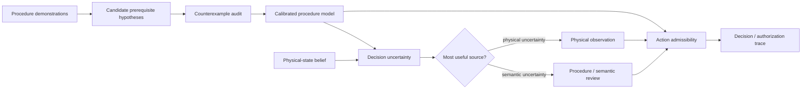

# DOVOD

**Decision-Oriented Verification of Observations and Dependencies**

**A research framework for validating procedural dependencies from demonstrations and choosing what information to acquire next under uncertainty.**

DOVOD studies one procedural decision problem from two tightly connected sides:

1. **Which observed conditions are actually supported as prerequisites for an action?** Repeated order alone is not enough. Candidate relations are treated as falsifiable hypotheses and are removed when a successful counterexample is observed.
2. **What should the system check next when it is uncertain?** The decision layer distinguishes uncertainty about the physical state from uncertainty about the procedure model and chooses between a physical observation and a semantic/procedure review.

The repository is the software and reproducibility artifact of the project. Manuscripts and conference files are intentionally kept outside the codebase.

## Core idea



## Reference results

| Question | Frozen result |
|---|---:|
| Candidate unary relations considered | 272 |
| Refuted on MECCANO TRAIN | 201 / 272 |
| Refuted on IMPACT | 259 / 272 |
| Held-recording recall before -> after independent calibration | 0.8707 -> 0.8853 |
| MECCANO refutations surviving loss of one independent carrier | 162 / 201 |
| IMPACT refutations surviving loss of one independent carrier | 184 / 259 |
| Mixed-uncertainty episodes in the source-selection benchmark | 187 |
| Expected cost, myopic -> exact Bellman at semantic cost = 1 | 1.7380 -> 1.6657 |
| First-source decision changed by reliability-aware model (`r_p=.55`, `r_s=.85`) | 33.15% |

These are benchmark-specific methodological results. They do not certify mechanical truth, industrial safety, human benefit or live XR performance.

## Repository layout

```text
DOVOD/
├── src/procedural_ai/              # reusable library code
├── experiments/
│   ├── constraints/                # prerequisite-validation experiments
│   └── information_selection/      # source-selection experiments
├── research/reference_impl/        # preserved research implementations
├── prototypes/runtime/             # procedural runtime / XR prototype work
├── results/                        # compact frozen outputs
├── configs/                        # experiment configuration
├── data/                           # data instructions; raw datasets stay local
├── tests/                          # unit and snapshot tests
├── docs/                           # methods, boundaries and roadmap
└── scripts/                        # verification/reproduction entry points
```

## Install

Python 3.10+ is recommended.

```bash
git clone https://github.com/lebedeffson/DOVOD.git
cd DOVOD
python -m venv .venv
source .venv/bin/activate        # Windows: .venv\Scripts\activate
python -m pip install -U pip
pip install -e ".[dev]"
```

## Verify

No third-party dataset is required for the unit tests and frozen-result audit:

```bash
pytest -q
python scripts/verify_reference_results.py
```

## Full experiment rerun

The repository does not redistribute raw MECCANO/IMPACT material. Obtain the datasets under their original terms. For the MECCANO PSR archive either place it at:

```text
data/external/MECCANO_PSR_Annotations.zip
```

or set:

```bash
export PROCEDURAL_AI_MECCANO_PSR_ZIP=/absolute/path/MECCANO_PSR_Annotations.zip
```

Then run:

```bash
bash scripts/reproduce_core.sh
```

Individual experiment entry points live in `experiments/constraints/` and `experiments/information_selection/`.

## Stable API

```python
from procedural_ai import action_set

graph = {0: [], 1: [0], 2: [0, 1]}
state = [1, 0, 0]
print(action_set(state, graph))  # [1]
```

## Preserved research directions

The current two experiment families are not the end of the project. Earlier directions are retained explicitly:

- verifiable/fail-closed authorization and evidence certificates;
- real visual evidence routing and expensive-model escalation;
- online reliability/session adaptation;
- risk-aware procedural control;
- quantization, edge/runtime and OpenXR execution;
- cross-procedure transfer including IMPACT/IndustReal;
- progressive intent and selective assistance;
- procedure compiler / bounded autonomy;
- future feasibility and human-intervention studies.

See [`docs/research_roadmap.md`](docs/research_roadmap.md) and [`docs/preserved_code_index.md`](docs/preserved_code_index.md).

## Claim boundary

The central prerequisite analysis concerns unary, unconditional, same-state relations. Absence of a counterexample means **unfalsified in the observed evidence**, not mechanically proven. The source-selection experiments optimize a declared finite probabilistic model; live sensor/expert behavior requires separate calibration.

Read [`docs/claim_boundary.md`](docs/claim_boundary.md) and [`docs/datasets.md`](docs/datasets.md) before interpreting or reproducing results.

## Related work from the team

- Trofimov, Y. V., Averkin, A. N., Lebedev, A. D., Lebedev, M. D., et al. *Algebraic operations on multilevel explanations and quantification of their uncertainty*. Soft Measurements and Computing, 2026. DOI: `10.36871/26189976.2026.02-2.008`.
- Trofimov, Y. V., Lebedev, A. D., Ilin, A. S., Averkin, A. N. *Verified Explainability Core: A GD-ANFIS/SHAP Hybrid Architecture for XAI 2.0*. Automatic Documentation and Mathematical Linguistics, 59(S5), S469-S478. DOI: `10.3103/S0005105525701420`.

## Citation

Citation metadata is provided in [`CITATION.cff`](CITATION.cff).

## License

No open-source license has been selected yet. Until one is added, standard copyright restrictions apply.
