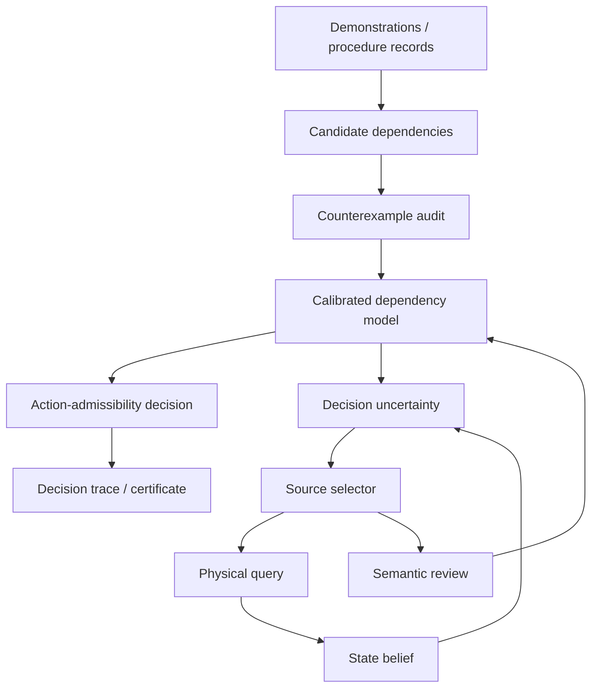

# Architecture

DOVOD separates reusable decision logic from research-only experiment code.

## Layers

### `src/procedural_ai/`

Maintained import surface. This layer contains the small set of concepts that are useful independently of a particular benchmark:

- procedure graph and action admissibility;
- counterexample-driven evidence handling;
- semantic version spaces;
- exact and myopic information-source planning;
- uncertainty updates;
- authorization certificates.

Code in this package should remain deterministic where possible and should not depend on benchmark-specific folder layouts.

### `experiments/`

Publication-level experiment entry points. These scripts may depend on frozen splits, reference outputs and dataset preparation conventions, but they should call the reusable logic rather than duplicate it.

Two top-level experiment families are maintained:

- `constraints/` — relation falsification, calibration and robustness;
- `information_selection/` — physical-vs-semantic acquisition policies.

### `research/reference_impl/`

Research implementations retained for audit and continuity. They may contain narrower assumptions, historical experiment contracts or benchmark-specific logic. Presence in this directory does not make a module part of the stable API.

### `prototypes/runtime/`

Executable-system boundary for procedure compilation, action/risk maps and runtime experiments. Runtime artifacts are kept separate from the benchmark evidence used to support the core methodological claims.

## Evidence flow

## Design rules

1. A relation observed repeatedly is still a hypothesis until stronger evidence is available.
2. A direct successful counterexample can falsify an unconditional prerequisite candidate.
3. Failure to observe a counterexample is not treated as mechanical proof.
4. Physical-state uncertainty and procedure-model uncertainty remain separate variables.
5. Evaluation-only data must not modify the model unless an experiment explicitly declares a calibration protocol.
6. Runtime heuristics and deployment artifacts are not silently promoted to held-out scientific evidence.
